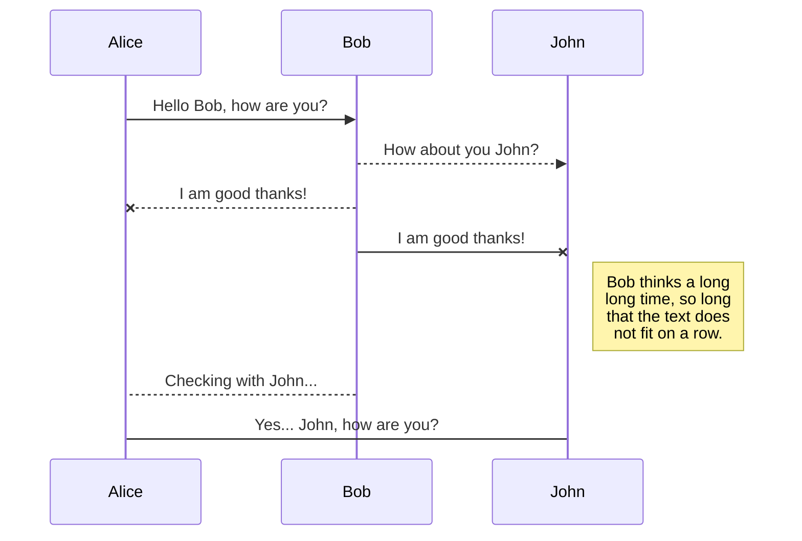

### HTML is very much considered the language of the web. So why did we cover Markdown? Well Markdown is used in simple situations where a lot of customization is not needed. It's mainly used by programmers in writing documentation of their code and is frequently seen in README files. HTML, however, is universally used and far more customizable and powerful. So let's get some practice with Markdown before we move on to HTML!

# my day
#### my day was amazing I learnt a lot and also did well on my **project!**

You can render LaTeX mathematical expressions using [KaTeX](https://khan.github.io/KaTeX/):

more practice

* Butter
* White sugar
* Brown sugar
* Eggs
* Vanilla

`'Isn't this fun?'`

`-- is en-dash, --- is em-dash`

$$
\Gamma(z) = \int_0^\infty t^{z-1}e^{-t}dt\,.
$$

